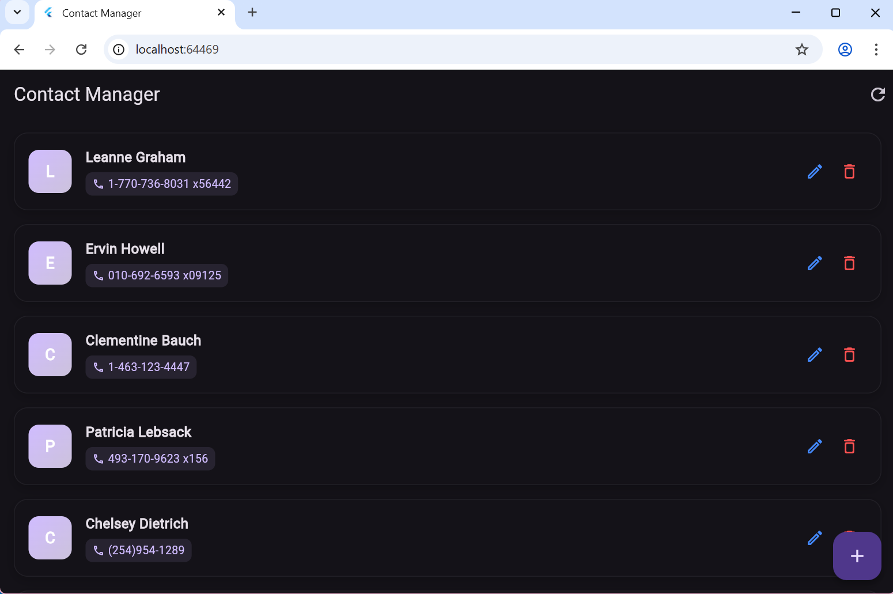
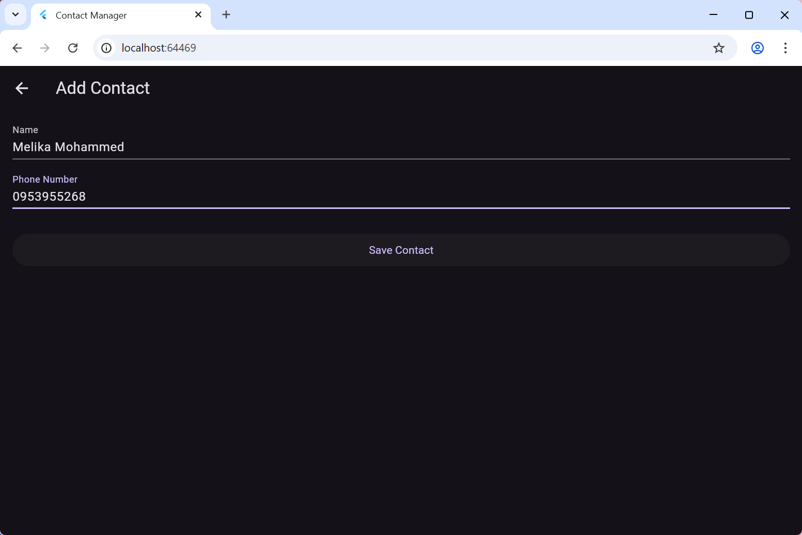
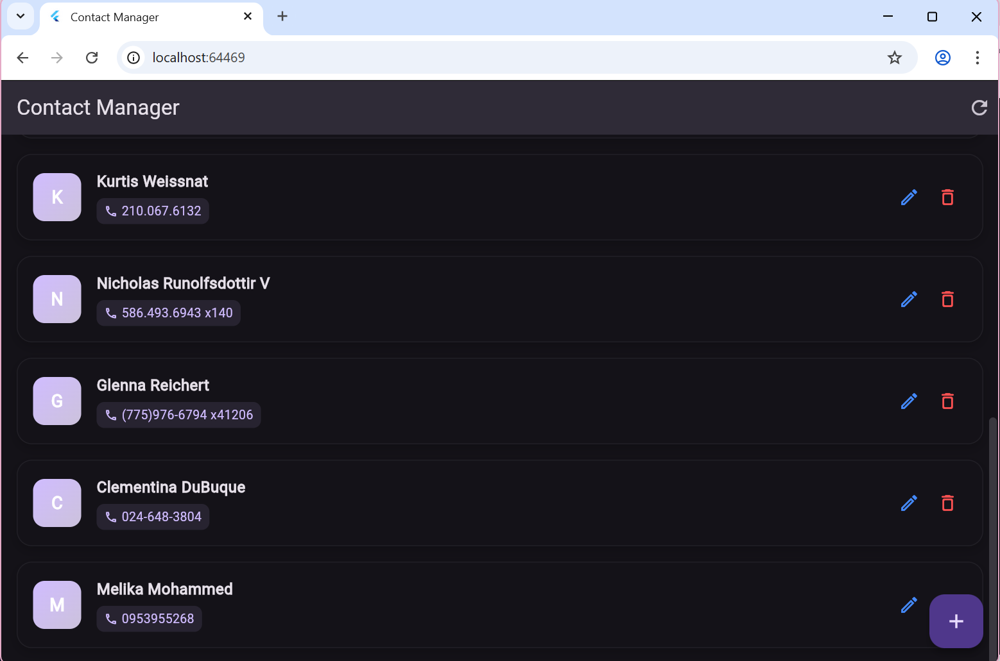
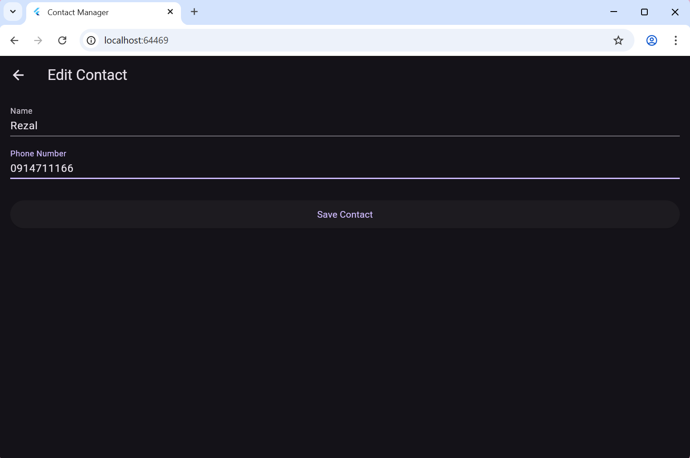
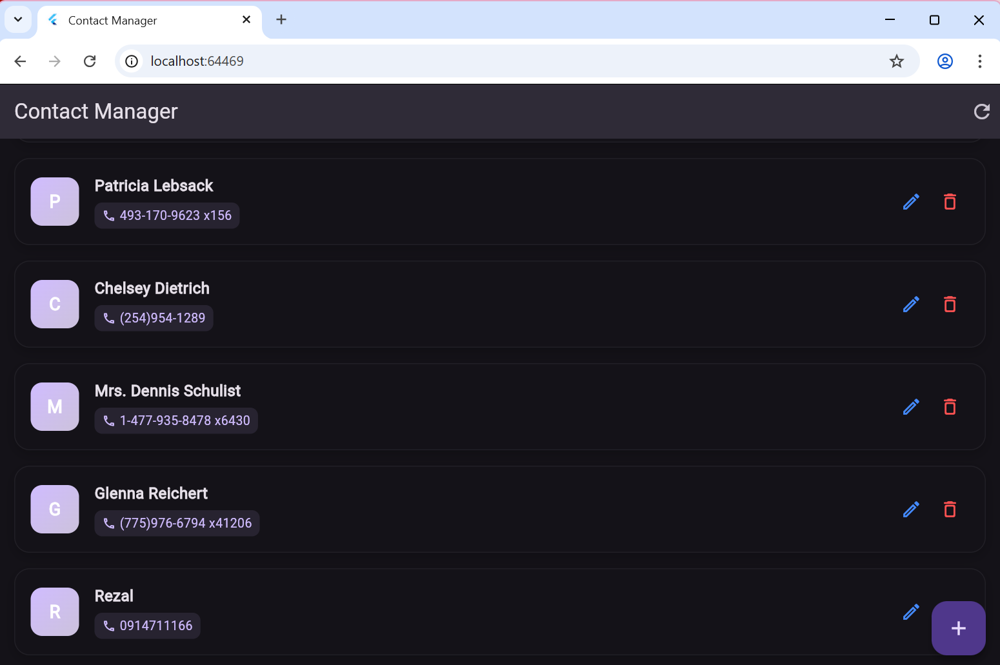
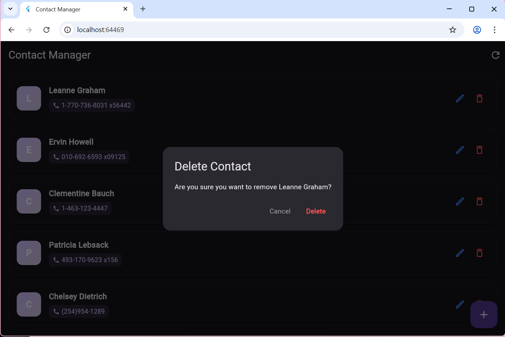

# 📞 Contact Manager App (Flutter BLoC & Dio CRUD API Consumption)

A sleek, modern, and production-ready Flutter application that allows users to seamlessly manage their personal contacts list. The application connects to a public REST API backend to dynamically synchronize user information across multiple device states.

Developed as an academic project to demonstrate enterprise-grade state separation, clean asynchronous network routing, and clean, responsive UI layouts.

---

## Core Application Features

### 1. Robust State Management with BLoC
The application relies entirely on the **BLoC (Business Logic Component)** architecture pattern using the `flutter_bloc` package to isolate execution contexts:
* **Event-Driven Communication:** User interactions are dispatched as strict immutable events (`FetchContacts`, `AddContactEvent`, `UpdateContactEvent`, `DeleteContactEvent`).
* **Predictable State Streams:** The UI layers remain stateless and reactive, wrapping components inside `BlocBuilder` to cleanly cycle between loading states, error barriers, and fully populated data arrays.

### 2. High-Performance Network Layer via Dio
Instead of standard HTTP wrappers, low-level network communications are decoupled using the **Dio client package**:
* Robust asynchronous handling of background JSON payload conversions.
* Centralized API endpoint routing mapping directly to the JSONPlaceholder resource ecosystem.

### 3. Fully Functional Contact Operations
The application offers an intuitive, responsive dashboard interface to manage contact records:
* **Dynamic Feed Rendering:** Contacts are loaded asynchronously and mapped into structured cards featuring clean, linear-gradient avatars and styled phone details.
* **Inline Modifications:** Users can instantly launch a dedicated form view to add new entries or update existing data attributes on the fly.
* **Preventive Data Purging:** Integrated safety verification dialog popups prevent accidental contact deletions before updates are sent to the network layer.

---

## Project Directory Structure
The workspace structure enforces a strict Separation of Concerns (SoC) layout:

```text
lib/
│
├── bloc/
│   ├── contact_bloc.dart       # State machine coordinating events and states
│   ├── contact_event.dart      # Immutable events triggered by user actions
│   └── contact_state.dart      # Distinct states emitted to the UI layer
│
├── data/
│   ├── models/
│   │   └── contact_model.dart  # Data model and factory map serializers
│   └── repositories/
│       └── contact_repository.dart # Isolated API communication endpoints
│
├── presentation/
│   ├── screens/
│   │   ├── contact_form_screen.dart # Dynamic creation and edit form layer
│   │   └── home_screen.dart    # Primary responsive feed display grid
│   └── widgets/
│       └── contact_tile.dart   # Premium card design widget components
│
└── main.dart                   # Root injection container and application bootstrapper
```

---

## CRUD Operations Mapping

| Operation | Trigger Location | State Mechanism | Network Method |
| :--- | :--- | :--- | :--- |
| **Create (C)** | Floating Action Button `+` | `AddContactEvent` | `POST` request |
| **Read (R)** | App Initialization Lifecycle | `FetchContacts` | `GET` request |
| **Update (U)** | Blue Pencil Card Icon | `UpdateContactEvent` | `PUT` request |
| **Delete (D)** | Red Trash Card Icon | `DeleteContactEvent` | `DELETE` request |

---

## Application Screenshots

| 1. Initial REST API Fetch (Read) | 2. Dynamic Creation Context (Create) |
| :---: | :---: |
|  |  |
| Shows live data rendering cleanly within the custom card components via initial GET requests. | Captures form text fields parsing validation criteria before executing a remote save. |

| 3. Mutated Local Grid Feed (Create Sync) | 4. Contextual Inline Modification (Update) |
| :---: | :---: |
|  |  |
| Proves that newly generated contact profiles successfully insert into the interactive local state feed. | Validates state pre-population when pushing existing target data parameters into the form. |

| 5. Updated Entity Verification | 6. Preventive UI Entity Purging (Delete) |
| :---: | :---: |
|  |  |
| Demonstrates reactive UI re-rendering following a successful inline update workflow cycle. | Confirms a clean UX confirmation modal dialog that safely processes backend removal operations. |

---

## Setup and Installation Instructions

1. Clone this repository down to your operating workspace environment:
   ```bash
   git clone [https://github.com/Melikamohammed1/Contact_Manager_app.git](https://github.com/Melikamohammed1/Contact_Manager_app.git)
   ```

2. Navigate into the parent directory root:
   ```bash
   cd contact_manager
   ```

3. Fetch all production dependencies specified inside the manifest file:
   ```bash
   flutter pub get
   ```

4. Boot up the compiler engine targets on your connected test device or native platform environments:
   ```bash
   flutter run
   ```